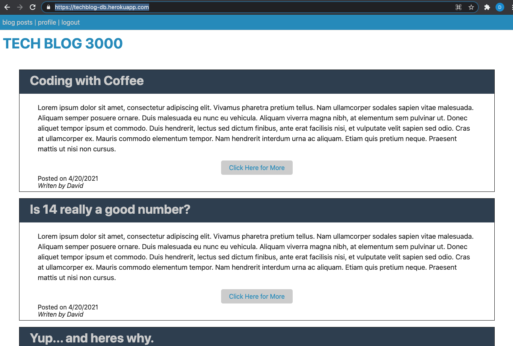
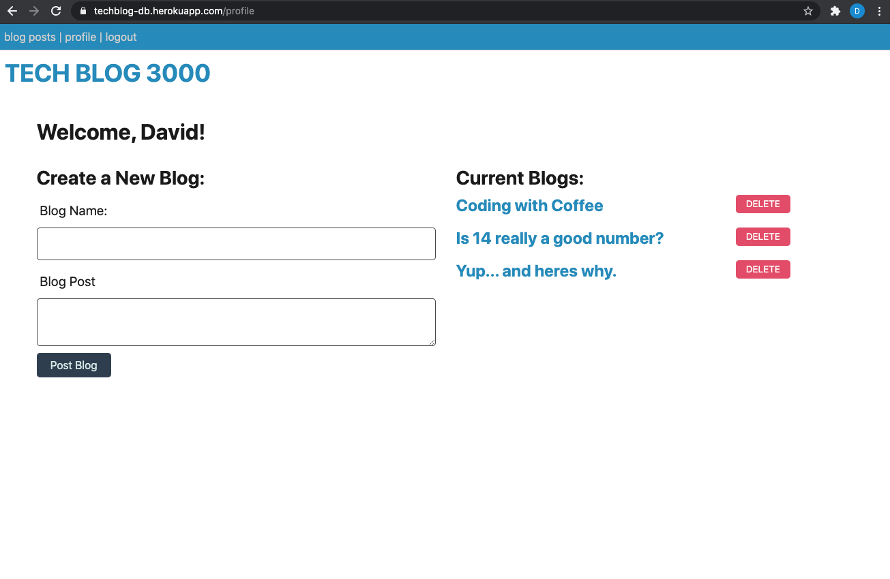
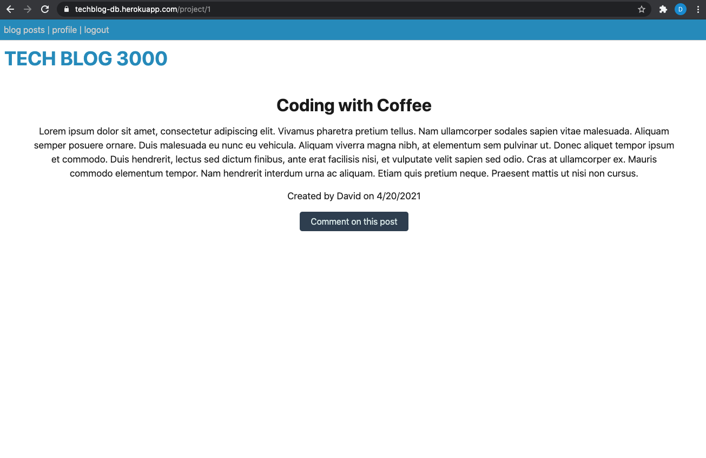

<h1 align="center">Tech Blog</h1>
<h4 align="center">David Bushard </h4> 
<h5 align="center">Homework 14 </h5>
 

## Table of Contents
- [Description](#description)
- [Installation](#installation)
- [Usage](#usage)
- [License](#license)
- [Contact Info ](#Contact-Info:)
 
 

## Description
Writing about tech can be just as important as making it. Developers spend plenty of time creating new applications and debugging existing codebases, but most developers also spend at least some of their time reading and writing about technical concepts, recent advancements, and new technologies. A simple Google search for any concept covered in this course returns thousands of think pieces and tutorials from developers of all skill levels!

Your task this week is to build a CMS-style blog site similar to a Wordpress site, where developers can publish their blog posts and comment on other developers’ posts as well. You’ll build this site completely from scratch and deploy it to Heroku. Your app will follow the MVC paradigm in its architectural structure, using Handlebars.js as the templating language, Sequelize as the ORM, and the express-session npm package for authentication.
 
 

### Tools used for this project was MySql, Javascript, CSS, Handlebars.
 
 

## User Story
As a developer who writes about tech that is like a CMS-style blog site
so I can publish articles, blog posts, and my thoughts and opinions 

 
 

## Installation
npm install -y
 
 

## Usage
npm run seed

npm run watch  --or--  npm sun start
 
 

## Links and Images
Repo - https://github.com/DavidBuoy/tech-blog
 
Heroku Deployment - https://techblog-db.herokuapp.com/
 
 

 

 

 

 
 

 

 

## Contact Info:
David Bushard

Find me on GitHub:

 
Email me with any questions: Davidbushard@gmail.com
 